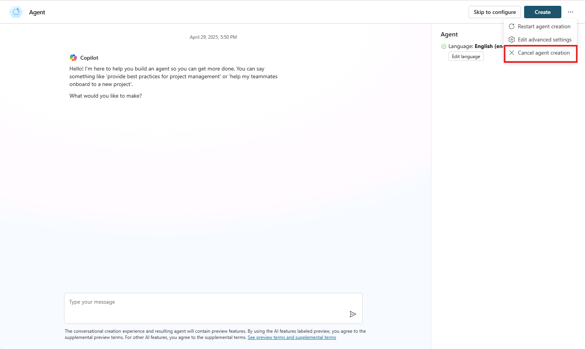
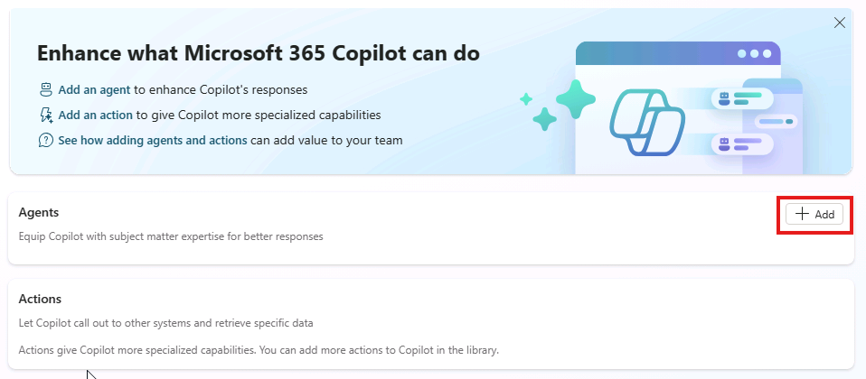
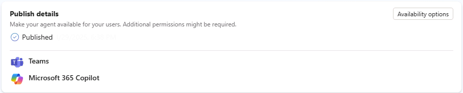
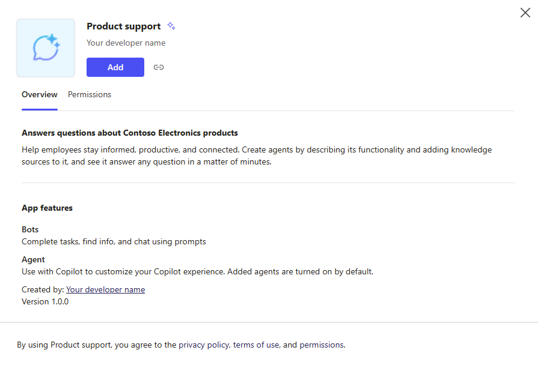
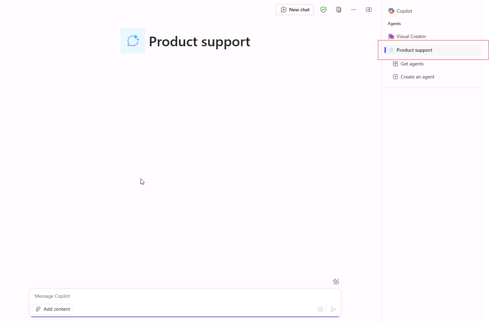
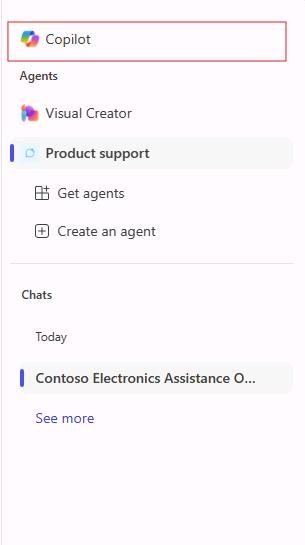
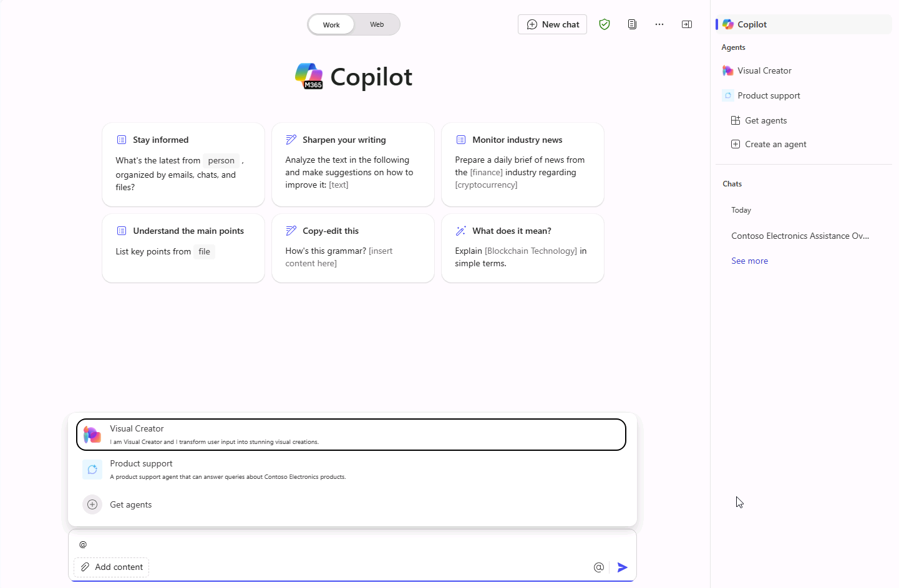
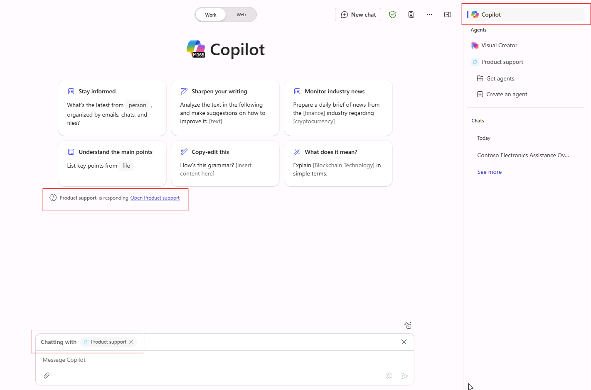
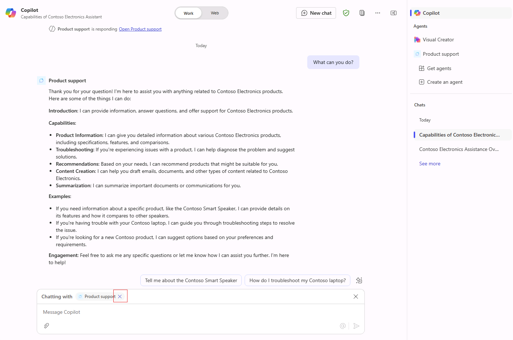

---
lab:
  title: 1.1：创建声明性代理
---

# 创建声明性代理

在本练习中，你将使用生成式 AI 创建声明性代理、优化说明、将代理发布到 Microsoft 365，并在 Microsoft 365 Copilot 中测试代理。

完成此练习大约需要 **20** 分钟。

## 使用生成式 AI 创建声明性代理

首先在 Copilot Studio 中创建新的声明性代理。 使用生成式 AI 起草代理的说明和属性。

1. 在 Web 浏览器中，导航到位于 `https://copilotstudio.microsoft.com` 的 [Microsoft Copilot Studio](https://copilotstudio.microsoft.com/)。
1. 使用你有权在 Copilot Studio 中创建的工作或学校帐户登录。
1. 如果在“**欢迎使用 Microsoft Copilot Studio**”页面上出现提示，请选择国家/地区，然后选择“**入门**”。
1. 如果你看到“**欢迎使用 Copilot Studio！**” 弹出窗口，选择“**跳过**”。
1. 到达 Copilot Studio 时，可能会从用于创建新代理的对话界面开始。 此向导可帮助你设置*自定义*代理。  选择 **...**，然后选择“**取消代理创建**”以退出此向导。  选择“**保存**”以确认。

    

1. 导航到左侧导航面板中的“**代理**”。
1. 从代理页中选择“**Microsoft 365 Copilot**”。
1. 在 **Microsoft 365 Copilot** 代理页上，选择“代理”部分中的“**添加**”。

    

    会将你发送到对话创作体验，你可以在其中描述要生成的代理。

1. 系统会要求你描述希望代理执行的操作。  在对话界面中的“**键入消息**”文本框中，输入以下内容：

    ```md
    I'd like to create a product support agent that answers questions related to Contoso Electronics products.
    ```

1. 选择 **Enter** 或“**发送**”以发送消息。
1. 如果系统提示为代理推荐名称，请输入 `Product support` 并发送消息。
1. 选择对话界面顶部的“**跳到配置**”，以查看代理的概述页面，并查看到目前为止配置的生成式 AI。

## 配置代理并定义说明

接下来，手动更新代理的属性和元数据。

1. 查看为代理定义的生成式 AI 向导的**名称**。 更新名称以确保名称为 `Product support`。
1. 将 **description** 属性的值更新为 `A product support agent that can answer queries about Contoso Electronics products`。
1. 在“**说明**”文本框中，输入：
  
    ```md
        You are an agent tasked with answering questions about Contoso Electronics products. Start every response to the user with "Thanks for using a Copilot agent!\n\n" and then answer the questions and help the user.
    ```

1. 选择页面顶部的“**创建**”以创建代理。  几分钟后，你将转至代理的概述页面。

## 在 Copilot Studio 中测试代理

接下来，在 Copilot Studio 内的测试窗格中测试代理的行为，然后再发布到 Microsoft 365 Copilot。

1. 在“**产品支持**”代理概述页面中，注意“**发布详细信息**”部分显示代理尚未发布。

    

1. 如果未在代理概述信息右侧显示“**测试代理**”窗格，请选择“发布”按钮旁边的“**测试**”按钮以打开测试窗格。
1. 在文本框中，输入 `What can you do?`，然后提交消息。
1. 正在等待响应。 请注意响应如何按之前为代理定义的说明中所示， 以文本“感谢使用 Copilot 代理！”开始。

    

    另请注意，代理当前有说明，但尚无任何自定义知识源或操作。 尚未将代理配置为回答有关 Contoso 产品的问题。 你将在下一个练习中进行此配置。

    > [!NOTE]
    > 如果需要编辑代理，请关闭测试窗格，然后在代理概述页面的“**详细信息**”部分中选择“**编辑**”。 再次测试之前，选择测试窗格中的“**刷新**”按钮以加载最新更改。

## 将代理发布到 Microsoft 365 Copilot

接下来，将声明性代理发布到 Microsoft 365 Copilot。 在“**产品支持**”代理概述页面中：

1. 选择**发布**按钮。 系统会提示你输入有关代理的信息，此类信息将向 Microsoft 365 Copilot 和 Microsoft Teams 中的用户显示。

    > [!NOTE]
    > 此表单上的信息用于填充组织的 Office 和 Teams 目录中的目录条目以及 Microsoft 管理中心集成应用列表。 Microsoft 365 Copilot 语言模型不使用它来调用代理。

1. 在“**简短说明**”文本框中输入 `Answers questions about Contoso Electronics products`。
1. 接受剩余字段的默认建议。
1. 选择**发布**。
1. 等待代理发布。  在发布期间不要关闭模式窗口。 这可能需要几分钟的时间。

    > [!NOTE]
    > 选择“发布”时，会在租户的 Microsoft Entra ID 环境中预配与代理对应的机器人资源。 用户可利用该资源在 Microsoft Teams 中与代理进行交互。

1. 发布代理后，将显示“**可用性选项**”窗口。
1. 在“**共享链接**”下，选择“**复制**”以复制代理的共享链接，然后选择“**完成**”。
1. 请注意，代理概述页面的“**发布详细信息**”部分反映代理已发布。

    

    如果需要再次复制共享链接，请从“**发布详细信息**”部分选择“**可用性选项**”。

1. 在 Web 浏览器中打开一个新选项卡，将共享链接粘贴到 URL 栏中，然后选择 **Enter**。 此时会显示一个模式窗口，其中包含代理的概述。 这会显示你在发布期间提供的面向用户的代理相关信息，以及代理所需的权限。

    

1. 选择“**添加**”，将代理添加到 Microsoft 365 Copilot。
1. 等待添加代理。 代理在 Microsoft 365 Copilot 中启动。

## 在 Microsoft 365 Copilot 中测试代理

接下来，让我们在 Microsoft 365 Copilot 中运行声明性代理，并在**沉浸式**体验和**上下文中**体验中验证其功能。

按照前面的步骤，你当前处于**沉浸式**代理体验中。 请注意，在右侧的“**代理**”窗格中，选择“**产品支持**”作为你当前正在直接与之聊天的代理。



1. 在文本框中，输入 `What can you do?`，然后提交消息。
1. 发送消息并等待响应。 请注意响应如何按你在代理说明中的指导， 以文本“感谢你提出问题！”开始。

在浏览器中继续，让我们测试**上下文中**体验。

1. 在聊天窗口右侧的“**代理**”窗格上方，选择 **Copilot**，退出与**产品支持**代理的沉浸式聊天，并与 Microsoft 365 Copilot 聊天。

    

1. 在消息框中输入符号 <kbd>@</kbd>。 浮出控件将显示一个可用代理列表。

    

1. 在浮出控件中，选择“**产品支持**”。 请注意消息框上方的状态消息。 它显示“**与产品支持聊天**”，表示你正在使用代理的上下文中体验。

    

1. 在文本框中，输入 `What can you do?`，然后提交消息。

1. 正在等待响应。 请注意响应如何按你在代理说明中的指导， 以文本“感谢你提出问题！”开始。

1. 若要退出上下文中体验，请在状态消息中选择 (X)。 请注意，状态消息已删除，并且聊天窗口中会显示一条消息，指示你不再与代理聊天。

    

现已在 Microsoft 365 Copilot 的沉浸式体验和上下文中体验中测试了代理。
