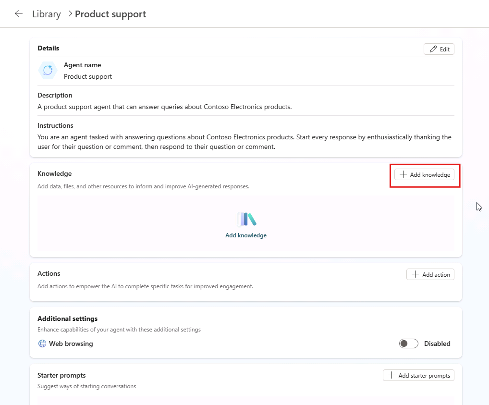

---
lab:
  title: 1.2：添加自定义知识
---

# 添加自定义知识

在本练习中，你将使用自定义说明和基础数据更新在上一练习中创建的声明性代理。 本练习假定你有一个 SharePoint 网站，其中包含一个名为“产品”的文档库，且文档库中附带了示例产品文件。

完成此练习大约需要 **20** 分钟。

## 开始之前

在开始本练习之前，你需要将产品相关文档上传到声明性代理用作基础数据的 Microsoft 365。 完成以下步骤，为练习做好准备。

> [!NOTE]
> 将文档上传到新的 SharePoint Online 网站时，在文档的索引编制完成并可供 Copilot 使用之前，会有所延迟。 如果要立即测试代理，请将文档上传到某个**现有**站点。 文档将编制索引，并可在无任何延迟的情况下供代理使用。 如果选择使用新的 SharePoint Online 网站，文档可能需要更长的时间才能编制索引，以及可供 Copilot 使用。
>
> **以下说明将指导你将文档上传到新网站**。 如果要使用现有网站，请从标记为**上传示例数据**的部分开始，并使用现有库来替代**产品**库。

### 下载示例数据

1. 在 Web 浏览器中，导航到课程的 [GitHub 存储库](https://github.com/MicrosoftLearning/MS-4022-Extend-Microsoft-365-Copilot-in-Copilot-Studio/blob/master/Allfiles/Products.zip)。
1. 选择“**下载原始文件**”按钮以下载 **Products.zip**。

    :::image type="content" source="../media/download-github.png" alt-text="Microsoft Edge 的屏幕截图，其中突出显示了 GitHub 中的下载原始文件按钮。":::

1. **打开**下载的文件夹，并将**所有**内容提取到计算机上名为 `Products` 的新文件夹中，以备后续访问。

### 创建 SharePoint 站点

1. 在 Web 浏览器中，导航到 [https://www.microsoft365.com](https://www.microsoft365.com)，并使用此实验室所用的 Microsoft 365 帐户**登录**。
1. 在左侧菜单中，选择“**应用**”（网格图标），然后从应用目录中选择“**SharePoint**”。
1. 在左侧菜单中，选择“**创建**”（加号图标），然后选择“**网站**”。
1. 选择“**团队网站**”作为网站类型。
1. 在“**选择模板**”页上，选择“**标准团队**”。
1. 在“**预览**”页上，选择“**使用模板**”。
1. 在“**为网站指定名称**”页上，输入 `Product support`，然后选择“**下一步**”。
1. 在下一个配置页上，将“**隐私设置**”更改为“**公开**”。
1. 选择**创建站点**。 创建网站可能需要一段时间，然后“**完成**”按钮才会激活。
1. 选择“完成”。

### 创建文档库

1. 从**产品支持** SharePoint 网站中，选择页面顶部的“**新建**”按钮，然后选择“**文档库**”。
1. 在“**创建新文档库**”页上，选择“**空白库**”。
1. 在“**名称**”字段中输入 `Products`，然后选择“**创建**”。

### 上传示例数据

1. 在“**产品**”库中，选择“**上传**”按钮，然后选择“**文件**”。
1. 导航到先前步骤中在计算机上保存示例文件的文件夹。
1. 对本地 Products 文件夹中的所有文件执行“**全选**”操作，然后选择“**打开**”将其上传到 SharePoint。
1. 等待上传完成。 文件现在将显示在 SharePoint 的**产品**库中。

### 复制 SharePoint URL

接下来，将直接 URL 复制到网站，以便在配置代理的知识时使用。

1. 从 SharePoint 的**产品**库页中，选择右上角的“**设置**”图标，选择“**库设置**”，然后选择“**更多库设置**”。

    :::image type="content" source="../media/sharepoint-library-settings.png" alt-text="Microsoft Edge 的屏幕截图，其中显示了设置菜单中的“库设置”选项。":::

1. 找到 **Web 地址**属性。 你的 **SharePoint 网站 URL** 是 `https://DOMAIN.sharepoint.com/sites/SITE_NAME/LIBRARY_NAME` 格式的 Web 地址部分。 URL 应为 `https://DOMAIN.sharepoint.com/sites/ProductSupport/Products`。
1. **复制** SharePoint 网站 URL 并保存，以在后续实验室步骤中使用。

## 使用自定义知识配置代理

将 SharePoint URL 作为基础知识源添加到代理。

### 添加 SharePoint URL

1. 在 Web 浏览器中，导航到位于 `https://copilotstudio.microsoft.com` 的 [Microsoft Copilot Studio](https://copilotstudio.microsoft.com/)。
1. 选择“**代理**”。
1. 选择“Microsoft 365 Copilot”****。
1. 选择“产品支持”**** 智能体。
1. 在智能体概述页面的“知识”部分中，选择“添加知识”********。

    

1. 在已打开向导的“**添加知识**”页面上，选择“**SharePoint**”。
1. 在文本框中，粘贴**产品** SharePoint 库的 URL，然后选择“**添加**”。 它应采用格式 `https://DOMAIN.sharepoint.com/sites/ProductSupport/Products`。

1. 在“**添加 SharePoint**”窗口中选择“**添加**”，然后等待知识源添加到代理。 此操作可能会需要一两分钟的时间。
1. 请注意，**产品**库在代理概述信息的“**知识**”部分下列出。

> **备注**：Copilot Studio 代理代表用户访问文档。 代理只能从最终用户有权访问的文档获取答案和内容。

### 更新自定义说明

接下来，更新代理的说明，以描述代理应如何使用知识源。

1. 在 Copilot Studio 中代理的概述页面中，选择“**详细信息**”部分中的“**编辑**”。
1. 将“**说明**”文本框的内容更新为以下内容：`You are an agent tasked with answering questions about Contoso Electronics products. Start every response by enthusiastically thanking the user for their question or comment, then respond to their question or comment. You will use documents from the Products folder in SharePoint as your source of information. If you can't find the necessary information, you should suggest that the agent should reach out to the team responsible for further assistance. Your responses should be concise and always include a cited source.`
1. 在“**详细信息**”部分中，选择“**保存**”。

## 在 Copilot Studio 中测试代理

最后，测试代理能否使用自定义知识源。

1. 在 Copilot Studio 中代理概述页面的“**测试代理**”窗格中，选择“**刷新**”按钮以刷新测试窗格，并加载代理的最新更改。
1. 在测试对话的文本框中，输入 `Tell me about Eagle Air`，然后发送消息。
1. 正在等待响应。 请注意，回复包含有关 Eagle Air 无人机的信息。 响应包含对 SharePoint Online 中存储的 Eagle Air 文档的引文和引用。

让我们再尝试一些提示：

1. 在消息框中，输入 `Recommend a product suitable for a farmer`，然后发送消息。
1. 正在等待响应。 请注意，回复包含有关 Eagle Air  的信息，以及关于为什么建议 Eagle Air 的额外上下文。 响应包含对 OneDrive 中存储的 Eagle Air 文档的引文和引用。
1. 在消息框中，输入 `Explain why the Eagle Air is more suitable than Contoso Quad`，然后发送消息。
1. 正在等待响应。 请注意，回复更详细地说明为什么 Eagle Air 比 Contoso Quad 更适合农民使用。

最后，我们通过提出代理无法回答的问题来测试回退响应：

1. 在消息框中，输入 `When was Mark8 released?`，然后发送消息。
1. 正在等待响应。 请注意，响应建议代理应联系负责进一步提供帮助的团队，如说明中所述。
