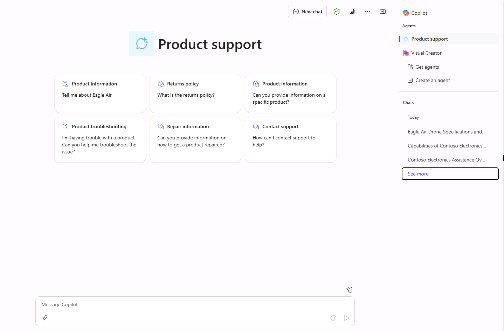

---
lab:
  title: 1.3：添加初始提示
---

# 添加初始提示

在本练习中，你将使用六个初始提示更新在上一练习中创建的声明性代理。

完成本练习大约需要 10 分钟****。

## 定义初始提示

在 Copilot Studio 中：

1. 导航到**产品支持**代理的“**概述**”页面。
1. 在“**初始提示**”部分中，选择“**编辑**”。
1. 添加以下六个初始提示：

      | 标题                  | 文本                                              |
      |------------------------|--------------------------------------------------|
      | 产品信息    | 告诉我有关 Eagle Air 的信息                          |
      | 退货政策         | 什么是退货政策？                      |
      | 产品信息    | 是否可以提供有关特定产品的信息？ |
      | 产品故障排除| 我遇到了产品问题。 你能帮我对问题进行故障排除吗？ |
      | 修复信息     | 能否提供有关如何修复产品的信息？ |
      | 联系客户支持        | 如何联系支持人员以获取帮助？              |

1. **保存**所做更改。

## 发布代理

我们来将更新的代理发布到 Microsoft 365 Copilot。

1. 选择 Copilot Studio 中代理概述页面右上角的“**发布**”。
2. 在打开的模式窗口中，选择“**发布**”。
3. 在打开的“**可用性选项**”窗口中，选择“**共享链接**”标题下的“**复制**”。
4. 在 Web 浏览器的其他选项卡中，**粘贴**代理的共享链接并选择 **Enter**。 此时会显示一个描述**产品支持**代理的窗口。
5. 选择代理名称下的“**立即更新**”，将更改发布到产品支持代理。 更新代理时请稍等片刻。
6. 更新完成后，关闭模式窗口。 如果未在浏览器中转至 Microsoft 365 Copilot，请从左侧菜单或 Microsoft 365 门户中的“**应用**”菜单中选择“**Copilot**”。

## 在 Microsoft 365 Copilot 中测试代理

1. 在 **Microsoft 365 Copilot** 中，选择右上角的图标以**展开 Copilot 侧面板**。
2. 在代理列表中查找“**产品支持**”并选择它，以输入沉浸式体验，直接与代理聊天。 请注意，Copilot Studio 中定义的初始提示将显示在用户界面中。

    
3. **选择**初始提示并查看响应。
