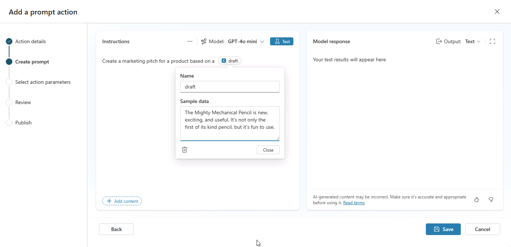

---
lab:
  title: 2.1：创建提示操作
---

# 创建提示操作

在本练习中，你将创建提示操作、在 Copilot Studio 中测试提示，并在 Copilot 代理中测试提示。 你将创建一个提示操作，来帮助用户将原始想法转化为遵循特定格式和指南的条理清晰的营销推介。

完成此练习大约需要 15 分钟****。

## 在 Copilot Studio 中创建自定义提示

1. 通过导航到位于 `https://copilotstudio.microsoft.com` 的 [Copilot Studio](https://copilotstudio.microsoft.com)，在 Web 浏览器中打开 Copilot Studio。
1. 在左侧导航栏中选择“工具”****。
1. 选择“新建”，然后选择“提示”********。 你会进入提示生成器 UI。
1. 在“**说明**”文本框中，输入 `Create a marketing pitch for a product based on a `。
1. 将光标置于输入的句子末尾，然后选择“**添加内容**”
1. 选择“文本”。
1. 在“名称”字段中，输入 `draft`。
1.  在“**示例数据**”字段中，输入 `The Mighty Mechanical Pencil is new, exciting, and useful. It's not only the first of its kind pencil, but it's fun to use.`，然后选择“**关闭**”。

    

## 测试并优化提示

1. 在说明框上方选择“**测试**”，以使用提供的示例数据测试提示。
1. 查看测试运行的输出。

我们来优化提示，以创建结构化程度更高且更加一致的输出。

1. 在“**说明**”文本框中，将以下内容添加到现有说明中以修改提示：

    ```The pitch should follow the following Contoso guidelines:
       - Start with a brief hook
       - Describe unique value proposition
       - End with a call-to-action
       - Use an exciting and influential tone
    ```

1. 再次选择“**测试**”以重新测试提示。
1. 请注意响应的不同之处。
1. 选择“保存”。

## 配置并发布提示

保存提示后，将显示“配置用于智能体”窗口****。

1. 在“名称”**** 字段中，输入 `Create a Contoso Marketing Pitch`。
1. 在“智能体用于了解何时使用此工具的说明”字段中，输入 ****`Create a marketing pitch that follows Contoso guidelines`****，然后选择“下一步”。 你将转到“**创建提示**”页面。
1. 选择 **添加** 。

## （可选）向代理添加提示操作

如果已完成上一实验室并创建了声明性代理，则可以将此操作添加到代理，并更新代理的说明以引用该操作。

### 添加提示工具

1. 在 Copilot Studio 的边栏中，选择“智能体”****。
1. 选择“智能 Microsoft 365 Copilot 副驾驶®”****。
1. 在“智能体”下，选择要向其添加操作的“产品支持”智能体********。
1. 在页面的“工具”部分中，选择“添加工具”********。
1. 选择“提示”筛选器。****
1. 选择“创建 Contoso 营销宣传”提示****。
1. 选择“添加到代理”****。 该工具现已在产品支持智能体的“工具”中列出****。

### 配置提示工具

1. 从智能体概述页面的“工具”部分中，选择 ****`Contoso Marketing Pitch` 工具。 你将转到用于配置工具的属性和设置的页面。
1. 在提示工具的顶部导航栏中选择“输入”****。
1. 在“**其他输入**”下，选择“**添加**”。
1. 选择 **Draft** 变量。 此时会显示一个窗体。
1. 确保“**代理将如何填充此输入**”字段设置为“**动态填充最佳选项（默认值）**”。
1. 在“显示名称”字段中输入 `Initial draft`。****
1. 确保“**标识为**”字段设置为“**用户的整个响应**”
1. 在窗口右上方选择“**保存**”。

### 修改智能体的说明

更新智能体的说明，以提供有关使用提示的指导。

1. 在“**说明**”文本框中，将以下内容添加到现有说明文本：`Use the Contoso Marketing Pitch action to help marketing stakeholders craft pitches for products based on their draft ideas.`

## （可选）在 Copilot Studio 中测试提示工具

接下来，使用 Copilot Studio 中的提示工具测试智能体。

1. 在 Copilot Studio 中代理概述页面的“**测试代理**”窗格中，选择“**刷新**”按钮以刷新测试窗格，并加载代理的最新更改。
1. 在测试对话的文本框中，输入 `Create a Contoso marketing pitch based on the following draft: "Bouncy ball is the hottest product on the market for both youth and adults. It's durable and the largest of its kind."`，然后发送消息。
1. 查看响应，并注意智能体遵循你在自定义提示说明中提供的指导。

你已完成练习并验证了提示工具的功能。
