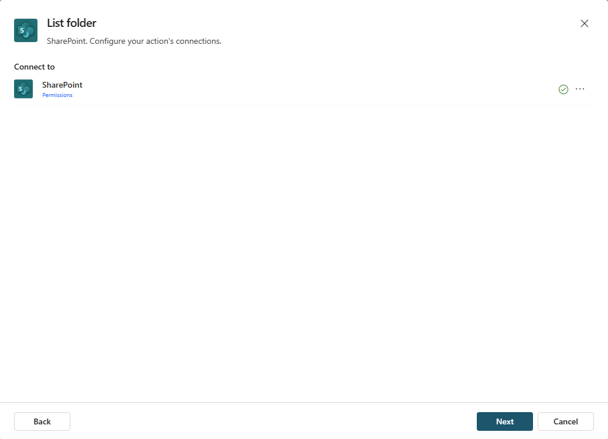

---
lab:
  title: 3.1：创建连接器操作
---

# 创建连接器操作

在本练习中，你将在 Copilot Studio 中为声明性代理配置连接器操作。 你将使用“SharePoint - 列表文件夹”连接器从包含产品支持文件的 Products 文件夹中检索文件列表。

完成此练习大约需要 15 分钟****。

## 开始之前

本练习重点介绍如何将连接器操作添加到现有代理。 本练习假定了以下内容：

1. 你已在 Copilot Studio 中创建了**产品支持**声明性代理。 如果需要有关创建声明性代理的说明，请参阅：[创建声明性代理](../01-Build-your-first-declarative-agent/01-create-declarative-agent.md)。
1. 你有一个名为**产品支持**的 SharePoint 网站，其中包含一个名为**产品**的文档库，文档库中包含附带示例产品相关数据的文件。 有关说明，请参阅[添加自定义知识](../01-Build-your-first-declarative-agent/02-add-custom-knowledge.md)练习中标题为**开始之前**的部分。

## 创建 SharePoint 连接器操作

1. 在 Web 浏览器中，导航到位于 `https://www.copilotstudio.microsoft.com` 的 [Copilot Studio](https://www.copilotstudio.microsoft.com)。
1. 在边栏中，选择“智能体”****。
1. 选择“智能 Microsoft 365 Copilot 副驾驶®”****。
1. 在“智能体”下，选择“产品支持”智能体********。
1. 在“**操作**”下，选择“**添加操作**”。
1. 在“**添加操作**”窗口的“**搜索**”栏中输入 `SharePoint`。 等待窗口中显示相关操作。
1. 浏览并选择“**列表文件夹 SharePoint**”连接器操作。
1. 模式窗口显示 SharePoint 连接器的连接。 连接处于活动状态时，连接器旁边将显示一个绿色复选标记。 可以选择 **...** 以查看有关连接的详细信息。
    
1. 在连接处于活动状态时选择“**下一步**”。 你将转至“**列表文件夹**”页，以便为操作配置属性。
1. 在“名称”文本框中，输入 `List product support files`。****
1. 在“**说明**”文本框中，输入 `List product support files available in the Products folder`。
1. 确认已将“**最终用户身份验证**”设置为“**用户身份验证**”。
1. 展开“**输入和输出**”部分。
1. 选择“**站点地址**”输入。
1. 在“**值**”文本框中，以 `https://DOMAIN.sharepoint.com/sites/ProductSupport` 格式输入**产品支持** SharePoint 网站的 URL，然后选择“**完成**”。
1. 选择“**文件标识符**”输入。
1. 从下拉列表中将“**代理将如何填充此输入？**”设置为“**设置为值**”，然后选择“**确认**”。
1. 在“**值**”文本框中，输入 `Products`，然后选择“**完成**”。
1. 选择“**添加操作**”按钮并等待 SharePoint 操作添加到代理。 该操作现在应在代理详细信息页的“**操作**”部分中列出。

## 配置操作

1. 在“**操作**”部分中，选择“**列出产品支持文件**”操作以打开其详细信息页。
1. 导航到“**输出**”选项卡。
1. 出于测试目的，在“**选择此操作结果的显示方式**”下，选中标记为“**运行操作后立即发送消息**”的框。 将显示另一个配置选项。
1. 选择“**如何向用户显示信息？**”下的下拉列表，然后选择“**创建消息**”。 将显示一个文本框。
1. 在“**要显示的消息**”文本框中，输入 `You used the SharePoint connector`，然后选择页面顶部的“**保存**”。

## 修改代理的说明

另外，我们来更新代理的说明，提供使用连接器操作的相关指导。

1. 在“**产品支持**”代理的“**详细信息**”部分中，选择“**编辑**”。
1. 在“**说明**”文本框中，将以下内容添加到现有说明文本：`When asked about available support resources, use the SharePoint connector to list the files in the Products folder.`
1. 选择“保存”。

## 使用操作测试代理

1. 展开代理详细信息页右侧的“**测试代理**”窗格。
1. 选择测试窗格中的“**刷新**”按钮以加载代理的最新更改。
1. 在消息框中，输入 `What product support files are available?`，然后发送消息。
1. 请注意，代理将通过消息“你使用了 SharePoint 连接器”进行响应，然后列出 Products 文件夹中的可用文件。

你已验证连接器操作在代理中是否按预期运行。
